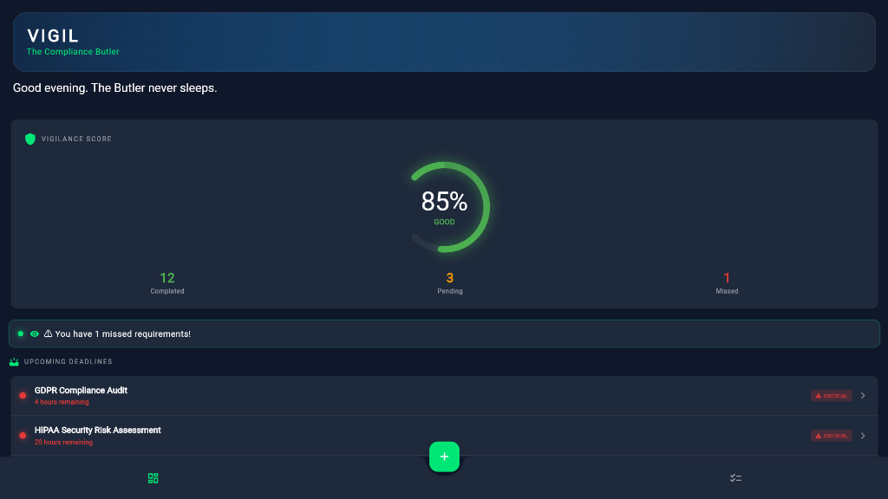
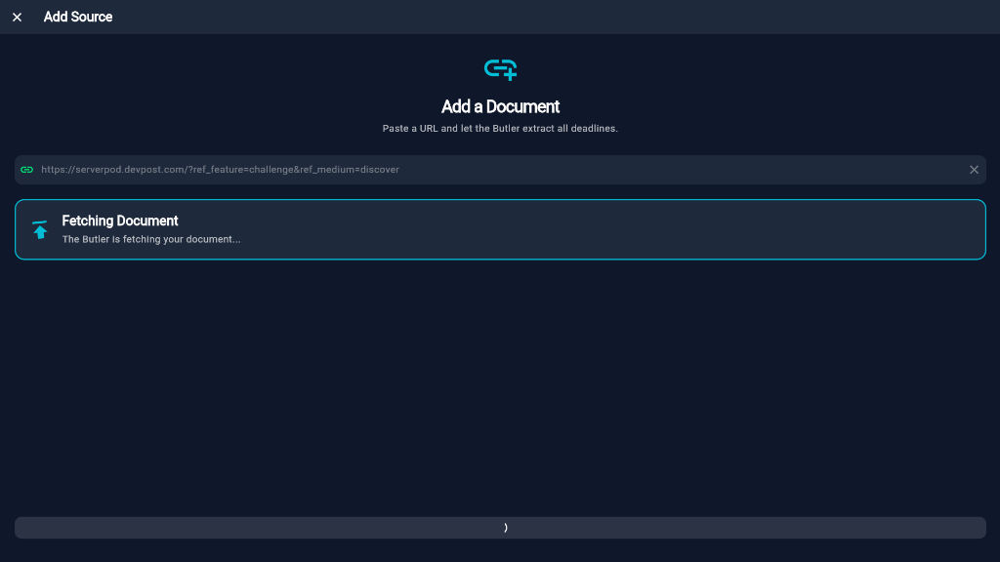
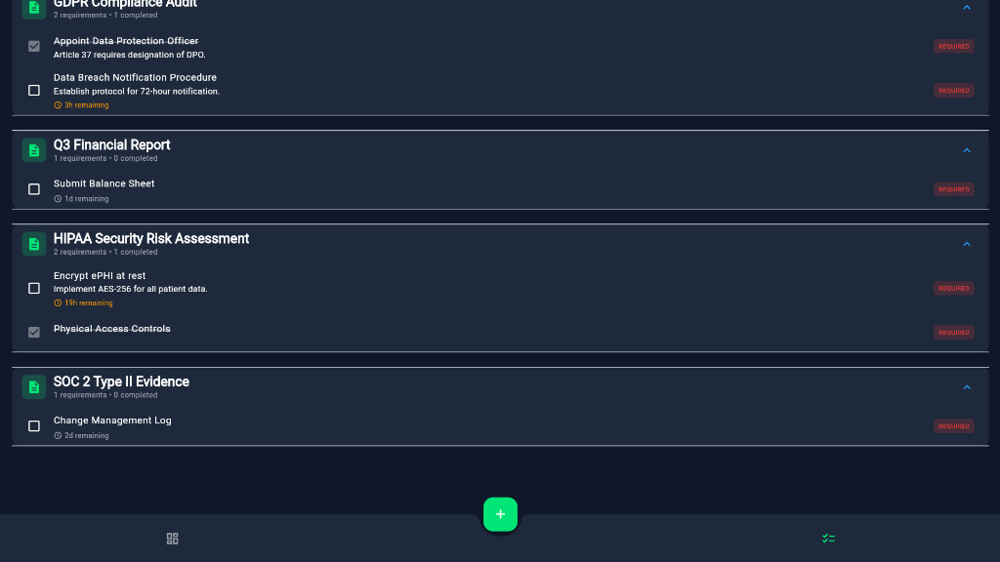
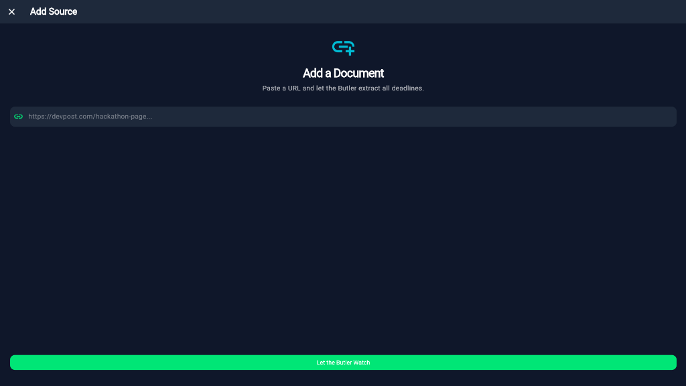

# 🛡️ Vigil: The High-Stakes Compliance Butler

> *"Compliance isn't just about following rules. It's about survival."*

## 📸 Visual Showcase

| Dashboard & Vigilance Score | Active AI Analysis |
|:---:|:---:|
|  |  |

| Guarded Requirements List | Document Ingestion |
|:---:|:---:|
|  |  |

---

## 🚨 The Problem: Compliance Fatigue
In high-stakes industries like **Finance, Healthcare, and Law**, missing a single deadline isn't just an "oops."
*   **GDPR Breach**: Up to €20 Million fine.
*   **HIPAA Violation**: $50,000 per record.
*   **SEC Filing Miss**: Delisting and lawsuits.

Yet, managing compliance is currently done in **Excel spreadsheets** and **messy email threads**. It's boring, prone to human error, and stressful.

## 💡 The Solution: Vigil
**Vigil is not a dashboard. It is an Agent.**
It is an AI-powered "Compliance Butler" that proactively ingests your documents, understands the legalese, and **nags you** until you are safe.

### ✨ Key Features
*   **🧠 AI Document Intelligence**: Drop a PDF (like a GDPR Audit or SOC 2 Report) or a URL. Vigil uses **Google Gemini** via Serverpod to extract every deadline, requirement, and mandatory action item.
*   **🛡️ The Vigilance Score**: A real-time, gamified health metric. If your score drops below 50%, the UI turns red. It forces you to pay attention.
*   **👀 Active Monitoring**: Vigil continually checks your "Guarded Requirements."
*   **💎 Premium "High-Stakes" UI**: A glassmorphic, cinematic interface designed to make compliance feel like a mission-critical command center, not a chore.

## 🌍 The Impact
By automating the "boring" part of compliance, Vigil allows officers to focus on **strategy** rather than **deadlines**.
*   **Reduced Risk**: AI doesn't get tired or forget dates.
*   **Gamification**: The "Vigilance Score" turns compliance into a game you want to win.
*   **Accessibility**: Making complex regulation understandable at a glance.

---

## 🛠️ The Tech Stack 

We built Vigil to demonstrate the power of **Dart full-stack**.

*   **Serverpod (Backend)**:
    *   Handles all API endpoints.
    *   Integrates **Google Gemini** for AI processing.
    *   Manages the Postgres database for persistence.
*   **Flutter (Frontend)**:
    *   **Web & Windows**: A single codebase running natively.
    *   **Custom Design System**: Glassmorphism, animated gradients, and smooth zoom transitions.
*   **AI Integration**:
    *   The backend sends document text to Gemini Pro.
    *   Gemini returns structured JSON with deadlines and "Urgency" ratings.

## 🚀 How to Run (Judges & Reviewers)

### Method 1: The Live Demo (Recommended)
Access our deployed version here: **[Insert Your Netlify Link Here]**
*   *Note: Includes a robust **Demo Mode** that simulates the backend experience if the server is offline.*

### Method 2: Local Development
**Backend:**
```bash
cd vigil_server
docker-compose up --build -d
dart bin/main.dart
```

**Frontend:**
```bash
cd vigil_flutter
flutter run -d chrome
```

---

## 🔮 What's Next?
*   **Auto-Emailing**: Vigil will draft emails to the responsible parties when deadlines approach.
*   **Slack Integration**: The Butler will DM you on Slack.
*   **Multi-Agent System**: Different agents for Legal (Lawyer Bot) vs. Finance (Accountant Bot).

---
*Built with ❤️ and ☕ by M S Abhishek*
